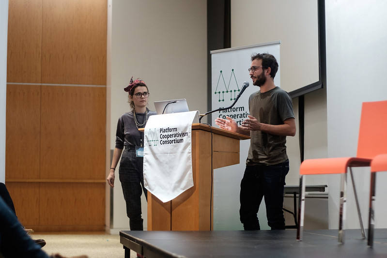

CoopCycle is an association that aims at creating an **European federation of local bike delivery cooperative** to mutualize costs and share the knowledge and lessons learned of a worker-owned delivery activity. The services offered by the network consist in developing a tailored platform/dispatch software that answers the needs of riders, advocating around bike delivery at different scales, applying for grants application or providing adivce on legislation, worker rights, marketing and branding.

We also created a custom licensing to restrict software access only to workers co-ops where production and economic value are democratically shared. Our objective is to allow couriers to build co-ops and then emancipate themselves from existing platforms (Deliveroo and co).

In 2021, CoopCycle gathered 65 collectives across three continents and six countries.

We won the Paris City Hall prize for Social Business (30k) and Call for Action in Seine-Saint-Denis (8k).

To learn more about the adventure: <https://coopcycle.org/en/>

## My contributions

As a member I'm involved at different stages of the projet from working group animation, grants application, and local coop support to meetings organization and outreach activities.

### Talks

"CoopCycle as a Showcase for Platform Cooperativsm". New-York Platform Cooperativism Consortium 2019

"How couriers can take control: A co-op alternative to Uber Eats and Deliveroo", Manchester Co-operatives UK. \[Novembre 2018\] [Video](https://www.youtube.com/watch?v=qB3nTICTDig&feature=youtu.be&t=566)

"CoopCycle as a Showcase for Platform Cooperativsm". Hong-Kong Platform Cooperativism Consortium 2018 \[Septembre 2018\] [Video](https://www.youtube.com/watch?v=OCHMLAjogzU)

