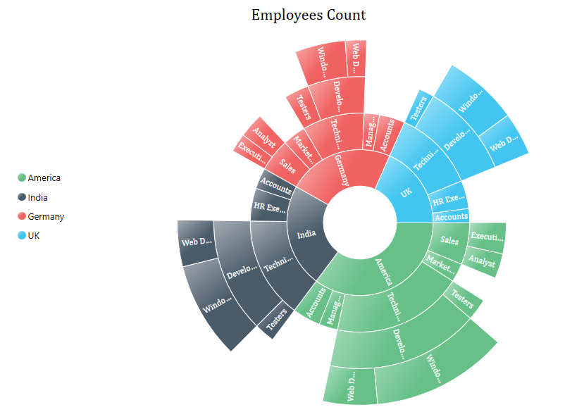

# Background

Bayesian models are great for hierarchical data, that is **observations that have a grouped structure**, typically grades of students that belongs to different classrooms in different schools.

This type of data structure violates the assumption of independence, key for basic models and can produce mislead conclusions, when the group-specific patterns differ from the global pattern.

But the point here is not to describe Bayesian hierarchichal models.

We are taking a step backward and **we want to visualise the hierarchical structure of our data**, for two reasons:

-   communicate with a lay audience

-   explore the groupings

Indeed there are two types of data hierarchy: crossed and nested. A **crossed design** happens when all combination of groupings exist (either in data or in reality). Typically if we were to distinguish between foreign-born and native students, we would expect that this grouping can occur in every classroom. On the opposite, a **nested design** describes a strict hierarchy, typically, one classroom belongs to one and only one school.

We want to show that sunburst charts[^1] are a great tool to visualise the hierarchy and combined with some tidyverse magic can unravel missing combinations.

[^1]: The example sunburst chart is from: [https://www.syncfusion.com/products/wpf/control/images/sfsunburst/sunburst.png)](https://www.syncfusion.com/products/wpf/control/images/sfsunburst/sunburst.png)')



# R set-up

```{r, message=F, warning=F}
library(tidyverse)
library(RColorBrewer)
library(kableExtra)
library(plotly) # contains function for sunburst plot
```

# Data

We will use a dataset provided by Leasure and al. as supplement to their paper [@leasure2020a].

```{r, eval=F}

# download  tutorial data
download.file(
  "https://www.pnas.org/highwire/filestream/949050/field_highwire_adjunct_files/1/pnas.1913050117.sd01.xls",
  '_posts/2021-07-31-unraveling-hierarchichal-data-structure-with-sunburst-charts/nga_demo_data.xls',
  method='libcurl',
  mode='wb'
)
getwd()
```

It consist in household surveys that collected information on the total population in 1141 clusters in 15 of 37 states in Nigeria during 2016 and 2017. The surveys are further described in @leasure2020 and @weber2018.

```{r}
# prepare data
data <- readxl::read_excel('_posts/2021-07-31-unraveling-hierarchichal-data-structure-with-sunburst-charts/nga_demo_data.xls')

data <- data %>% 
  mutate(
    id = paste0('cluster',1:nrow(data)),
    pop_density=N/A
  ) %>% 
  rename(
    population=N
  ) %>% 
  select(id, population, pop_density, type, region, state, local )

data %>% head()  %>% kbl() %>% kable_minimal()
```

There are two sources of grouping in the data: by settlement type and by administrative divisions. There is three levels of administrative divisions reported: region, state and local governement area `local`. Settlement type is characteristic of a **crossed hierarchy**: every settlement type can be (potentially) present in all subgrouping eg in all regions, states or local government area.

We plot first the variation of the response variable `population_density` by settlement type

```{r popDens-boxplot, class.source = 'fold-hide', fig.cap='Boxplot of population densities per region'}

# plot population density per region
ggplot(data %>% 
         group_by(
           region
         ) %>% 
         mutate(
           mean_popDens = mean(pop_density)
           ) %>% 
         ungroup(), 
       aes(fill=mean_popDens, x=pop_density, y=as.factor(region)))+
  geom_boxplot()+
  theme_minimal()+
  scale_fill_stepsn( colours = brewer.pal(6, "YlOrRd"))+
  labs(fill='Mean \npopulation \ndensity', x='Population density', y='Region')
```

Figure \@ref(fig:popDens-boxplot) shows the motivation for building a hierarchical model.

# Visualising the hierarchical structure

We will make the use of the chart type `sunburst`of the package `plotly`.

We need first to prepare the data with unique identifier for each administrative region:

```{r}
# create unique id for the nested admin level
data <- data %>% 
  mutate(state= paste0(state,region),
         local = paste0(state, local))
```

A sunburst chart is divided into concentric layers that are defined by the `id`of each grouping and its corresponding parent.

We define the first layer, that is the kernel of the circles with the level `type`from the hierarchy. Because it is the kernel it has no parents we leave this attribute blank. We define also an attribute `hover`to display the number of clusters in each grouping on hover.

```{r}
layer1 <- data %>% 
    group_by(type) %>% 
    summarise(n=n()) %>% 
    mutate(
      ids = paste0('settlement', type),
      labels = paste0('settlement <br>', type),
      parents = '') %>% 
    ungroup() %>% 
    select(ids,labels, parents,n) %>% 
  mutate(
    hover= paste('\n sample size', n)
  )

plot_ly(layer1, 
        ids = ~ids, 
        labels = ~labels, 
        parents = ~parents, 
        type = 'sunburst', 
        hovertext=~hover, insidetextorientation='radial')
```

The next level corresponds the region and has for parent the settlement type ids previously defined:

```{r, preview=TRUE}
sunburst_data_2layers <- rbind(
  # first layer
  layer1,
  # second layer
  data %>% 
    group_by(type, region) %>% 
    summarise(n=n()) %>% 
    mutate(
      ids = paste('settlement', type, '-', 'region', region),
      labels = paste0('region ', region),
      parents = paste0('settlement', type))%>% 
    ungroup() %>% 
    select(ids,labels, parents,n)%>% 
  mutate(
    hover= paste(ids, '\n sample size', n)
  )) 

plot_ly(sunburst_data_2layers, 
        ids = ~ids, 
        labels = ~labels,
        parents = ~parents, 
        type = 'sunburst', 
        hovertext=~hover, insidetextorientation='radial')
```

To get the full picture we add the two levels, `state`and `local` .

```{r group-schema, class.source = 'fold-hide', message=F, warning=F,class.source = 'fold-hide', fig.cap='Full grouping structure of the survey'}
# create data for sunburst plot
sunburst_data_4layers <- rbind(
  # first layer
  layer1,
  # second layer
  data %>% 
    group_by(type, region) %>% 
    summarise(n=n()) %>% 
    mutate(
      ids = paste('settlement', type, '-', 'region', region),
      labels = paste0('region ', region),
      parents = paste0('settlement', type))%>% 
    ungroup() %>% 
    select(ids,labels, parents,n)%>% 
  mutate(
    hover= paste(ids, '\n sample size', n)
  ),
  # third layer
  data %>% 
    group_by(type, region, state) %>% 
    summarise(n=n()) %>% 
    mutate(
      ids = paste('settlement', type, '-', 'region', region, '-', 'state', state, '-', 'region', region),
      labels = paste0('state ', state),
      parents = paste('settlement', type, '-', 'region', region))%>% 
    ungroup() %>% 
    select(ids,labels, parents,n)%>% 
  mutate(
    hover= paste(ids, '\n sample size', n)
  ),
  # fourth layer
  data %>% 
    group_by(type, region, state, local) %>% 
    summarise(n=n()) %>% 
    mutate(
      ids = paste('settlement', type, '-', 'region', region, '-', 'state', state,  '-', local),
      labels = paste0('local ', local),
      parents = paste('settlement', type, '-', 'region', region, '-', 'state', state, '-', 'region', region))%>% 
    ungroup() %>% 
    select(ids,labels, parents,n) %>% 
  mutate(
    hover= paste(ids, '\n sample size', n)
  )
)

plot_ly(sunburst_data_4layers, 
        ids = ~ids, 
        labels = ~labels, 
        parents = ~parents, 
        type = 'sunburst', 
        hovertext=~hover, insidetextorientation='radial')
```

Plotly enables interaction with the chart: click on the grouping to get the detailed picture of the hierarchy.

# Visualising missing combinations

It is important to explore what are the missing combinations in the data:.

1.  to understand the characteristics of our sample
2.  to index correctly the model

For that purpose we will make use of the wonderful function from the `tidyverse`suite: `complete`.

To demonstrate, we will use the two first layers that are `type`and `region`, such that we want to spot the regions that do not contain all settlement types:

```{r}
# create missing combinations
data_complete <- data %>% 
  complete(region, nesting(type))

data_complete %>% filter(is.na(local)) %>% kbl() %>% kable_minimal()
```

We see that two regions (4 and 10) comprise only settlement type 5.

We can visualise it with a sunburst chart by adding a color attribute:

```{r group-complete-schema,  class.source = 'fold-hide',, message=F, warning=F,class.source = 'fold-hide', fig.cap='Full grouping structure of the survey with missing groups'}
makeSunburst2layer <- function(data){
  layers <- rbind(
  # first layer
  data %>% 
    group_by(type) %>% 
    summarise(n=sum(!is.na(population))) %>% 
    mutate(
      ids = paste0('settlement', type),
      labels = paste0('settlement <br>', type),
      parents = '') %>% 
    ungroup() %>% 
    select(ids,labels, parents,n),
  # second layer
  data %>% 
    group_by(type, region) %>% 
    summarise(n=sum(!is.na(population))) %>% 
    mutate(
      ids = paste('settlement', type, '-', 'region', region),
      labels = paste0('region ', region),
      parents = paste0('settlement', type))%>% 
    ungroup() %>% 
    select(ids,labels, parents,n)) %>%
    mutate(
      hover= paste(ids, '\n sample size', n),
      color= ifelse(n==0, 'yellow','')
    )
  
 return(layers)
}

plot_ly() %>% 
   add_trace(data=makeSunburst2layer(data), 
             ids = ~ids, labels = ~labels, parents = ~parents, 
             type = 'sunburst', 
             hovertext=~hover, marker= list(colors=~color),  
             insidetextorientation='radial',
             domain = list(column = 0)) %>% 
     add_trace(data=makeSunburst2layer(data_complete), 
             ids = ~ids, labels = ~labels, parents = ~parents, 
             type = 'sunburst', 
             hovertext=~hover, marker= list(colors=~color),  
             insidetextorientation='radial',
             domain = list(column = 1))  %>%  
  layout(
      grid = list(columns =2, rows = 1),
      margin = list(l = 0, r = 0, b = 0, t = 0))
```
