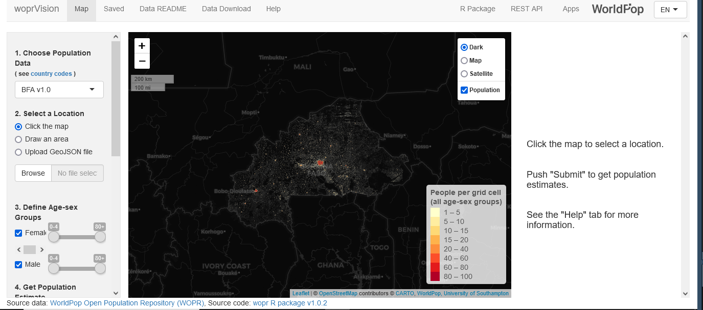

woprVision is an R shiny application that allows you to browse an interactive map to get population estimates for specific locations and demographic groups. It is

It has been developed for three reasons:

-   visualization of newly released population datasets

-   easy interaction with gridded population for people with limited GIS skills through (1) a drawing function, (2) a geojson upload function.

-   computation of adequate credible intervals for spatial aggregates from the full posterior distribution

woprVision is available online at <https://apps.worldpop.org/woprVision>.

Its source code is hosted here: <https://github.com/wpgp/wopr>

If run with local files, woprVision requires a SQLlite database with population prediction distribution for every grid cell and a tiled image of the gridded population.

Online, it runs on a shiny server and pings the WorldPop API.
