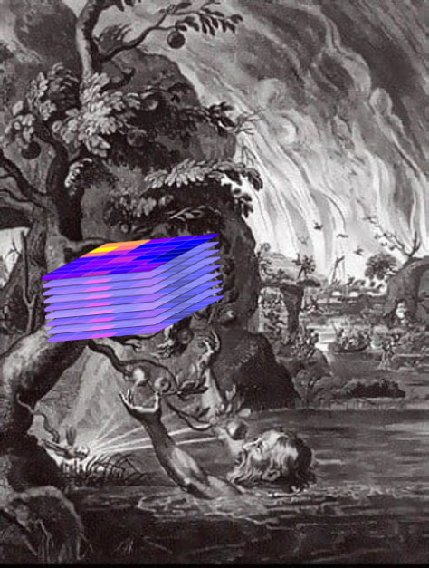
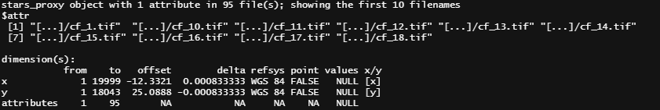
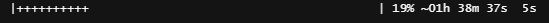

```{r setup, include=FALSE}
knitr::opts_chunk$set(echo = T, eval=F)
```

`stars` R package [@stars] has been for me for a while the 
unreachable R fruit, almost a Tantalus-like temptation.

```{r, eval=T, echo=F, out.width='50%', fig.align='center'}

```


And then I needed to compute the 95th percentile of a stack of 95 rasters.
I guessed `stars` could be a solution but my particular task - that is **summarising at grid cell level a raster stack** - was not directly covered
in the [manual]((https://r-spatial.github.io/stars/index.html)). 
And `stars` is still young and does not benefit of a long stash of StackOverflow questions (1000+ for the `r-raster`tag)

Therefore I will share the simple workflow of computing a quantile across a stack of raster in the `stars` framework.
I will cover the `stars` notions of: `dimension`, `stars_proxy` and `st_apply`.

You first **load the rasters in a stack named `y`**:

```{r, eval=F}
library(stars)
ls <- list.files(dir,  full.names=TRUE)
y <-  read_stars(ls, quiet=T, proxy =T, along='attributes')
```

Here occur our first two tricks.

First we read the rasters in a `stars_proxy` object which doesn't load the rasters in memory.

Second, we tell stars to create one object that stacks all the rasters, in a dimension called `attributes`, such
that `y` is a stars object with three dimensions: x, y, attributes.



Then we **compute our grid-cell metric** by using `st_apply` across this third dimension.

```{r, eval=F}
q_95 <- st_apply(y, 1:2, function(x)  quantile(x, probs=0.95, na.rm=TRUE), 
              PROGRESS = T,
              FUTURE = T)
```

Two last tricks:

1. `PROGRESS =T` shows a very informative progress bar 



2. `FUTURE = T` makes use of the parallel processing offered by the `future.apply` R package.

Lastly, in order to **actually run the computation**, we need to tell R to save the output such that it will
starts the process:

```{r, eval=F}
write_stars(q_95, outdir)
```

Results: the computation took 2h instead of 7h30.

