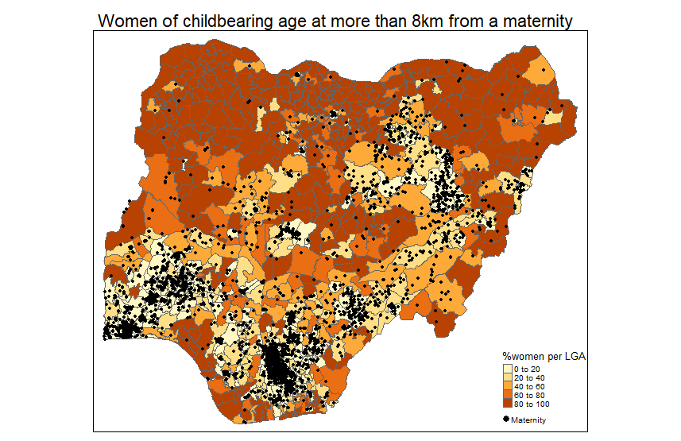

#' ---
#' title: "SICSS-Covenant:Using gridded population to gain spatial insights in R"
#' description: |
#'   I have been invited to present at the Summer Institute for Computational Social Sciences in University of Covenant. My talks starts is about gridded population as a tool to link  demographics and geography. It starts with a global overview of the definition, production and use of this innovative data and pursues with a hands-on in R to gain spatial insights on demography in Nigeria.
#' author:
#'   - name: Edith Darin
#'     url: {}
#' date: 06-24-2022
#' output:
#'   distill::distill_article:
#'     self_contained: false
#'     code_folding: hide
#'     includes:
#'       in_header: ../../wd/clicky.html
#' preview: './pic/final_map.png'
#' ---
#' 
#+ r setup, include=FALSE
knitr::opts_chunk$set(dir)
knitr::opts_knit(base.dir="C:/Users/ecd1u18/Documents/SICSS-covenant-gridded-population")

#' 
#' > *Extract from the [github repo](https://github.com/wpgp/SICSS-covenant-gridded-population) that contains the session's material.*
#' 
#' #  Linking demographics and geography: Using gridded population to gain spatial insights in R
#' 
#' ##  Introduction
#' 
#' Access to **high-resolution population counts** is key for local, national and international decision-making and intervention. It supports data-driven planning of critical infrastructures, such as schools, health facilities and transportation networks.
#' 
#' **WorldPop** has developed modelling techniques to estimate population in grid cells of 100m by 100m by disaggregating census-based population totals for the entire world, leveraging the growing availability of products derived from satellite imagery. This level of detail offers the advantage of flexible aggregation of the population estimates within different administrative and functional units, for instance, school catchment areas and health zones.
#' 
#' This session will cover the notion of **gridded population**, a data format at the crossroad of demography and geography. We will then have a brief overview of openly available **satellite-imagery-based products** that can be used for modelling gridding population and beyond, such as settlement maps. Finally, we will have some hands-on to extract information from a gridded population covering the following R packages for geospatial analysis: `sf` [(Pebesma, E., 2018)](https://r-spatial.github.io/sf/), `raster` [(Hijmans, R., 2021)](https://cran.r-project.org/web/packages/raster/index.html), and `tmap` [(Tennekes, M., 2018)](https://r-tmap.github.io/tmap/index.html).
#' 
#' ##  Challenge
#' 
#' We will study the question: *How many women of childbearing age are struggling to access maternal health services?*
#' 
#' 
#' 
#' ##  Concepts
#' 
#' This tutorial covers the concepts of:
#' 
#' -   interactive mapping
#' 
#' -   vector file reading and filtering
#' 
#' -   raster file reading
#' 
#' -   buffering
#' 
#' -   rasterising
#' 
#' -   zonal statistics
#' 
#' -   masking
#' 
#' ##  Contents
#' 
#' The script [`for_students.R`](https://github.com/wpgp/SICSS-covenant-gridded-population/blob/master/for_students.R) contains the workflow with the questions. The script [`teaching.R`](https://github.com/wpgp/SICSS-covenant-gridded-population/blob/master/teaching.R) contains the workflow with the answers. The powerpoint [`SICSS_20220624_griddedPop.pptx`](https://github.com/wpgp/SICSS-covenant-gridded-population/blob/master/SICSS_20220624_griddedPop.pptx) contains the presentation.
#' 
#' ##  Data used
#' 
#' For that purpose, we will need to access three data sources:
#' 
#' 1.  Population data from the Bottom-up gridded population estimates for Nigeria, version 2.0, produced jointly by WorldPop and the National Population Commission of Nigeria and accessible [here](https://wopr.worldpop.org/?NGA/Population/v2.0),
#' 
#' 2.  Health facilities locations produced by GRID3 Nigeria and accessible [here](https://data.grid3.org/datasets/GRID3::grid3-nigeria-health-care-facilities--1/about),
#' 
#' 3.  Local Government Area operational boundaries released by GRID3 Nigeria and accessible [here](https://data.grid3.org/datasets/GRID3::grid3-nigeria-local-government-area-boundaries/about)

#+ echo= F
setwd()

library(tidyverse)
library(tmap)

tmap_mode('view')
tmap_options(check.and.fix = TRUE) 

#'  Defining the study area -------------------------------------------------
library(sf)

lga <- st_read('data/GRID3_Nigeria_-_Local_Government_Area_Boundaries/GRID3_Nigeria_-_Local_Government_Area_Boundaries.shp')

lga %>% 
  st_drop_geometry() %>% 
  View()

leaflet(lga) %>% 
  addPolygons() %>% 
  addTiles()

tm_shape(lga)+
  tm_polygons()

lga_Ado <- lga %>% 
  filter(lga_name_x=='Ado Odo/Ota')

tm_shape(lga_Ado)+
  tm_borders(col='orange', lwd=5)+
tm_shape(lga)+
  tm_borders()+
  tm_basemap('OpenStreetMap')

