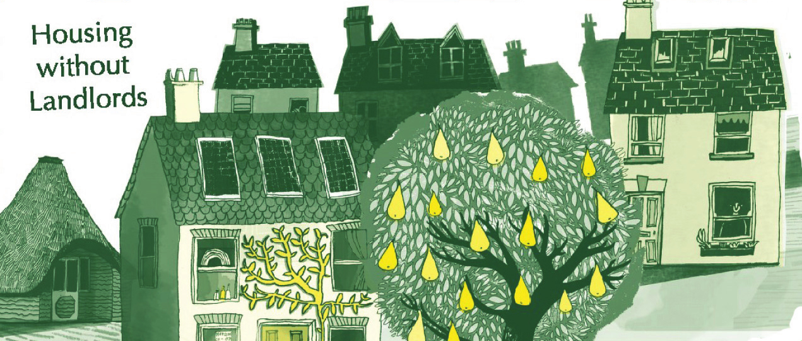

```{r setup, include=FALSE}
knitr::opts_chunk$set(echo = FALSE)
```



For more info, see [here](https://www.radicalroutes.org.uk).

Radical Routes is a network of co-ops and individuals seeking to see a world based on equality and co-operation, where people give according to their ability and receive according to their needs, where work is fulfilling and useful and creativity is encouraged, where decision making is open to everyone with no hierarchies, where the environment is valued and respected in its own right rather than exploited.

We are working towards taking control over our housing, education and work through setting up housing and worker co-ops, and co-operating as a network.

The specific means it is pursuing are:

-   The setting up of housing co-ops to house people and projects with the above aims.

-   The setting up of workers co-ops which operate with the above aims.

-   The promotion and organisation of participatory education through skills- and knowledge-sharing events, Taking Control events, informative material and workshops.

-   The raising of finance to take control over resources (property, technology, land…) through co-operation and economic interlocking of the co-ops.

-   The support of like-minded projects.

I specifically participate to the Finance Working Group which reviews loan applications, supports co-ops at every stage of setting up their business, including raising finance and doing financial planning with our cash-flow forecast modeling spreadsheet and runs a participatory budget setting for Radical Routes.
