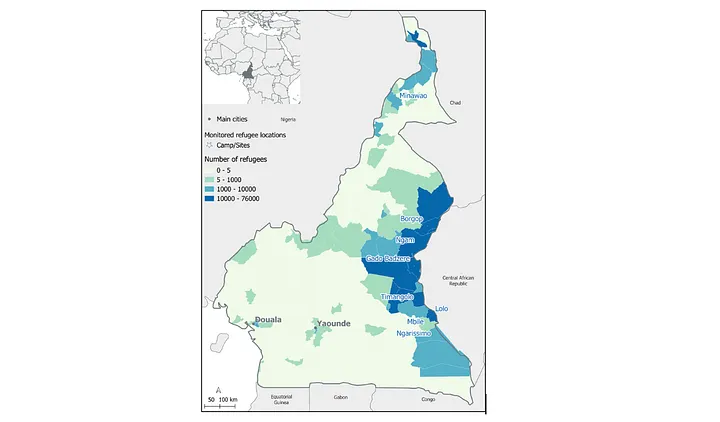
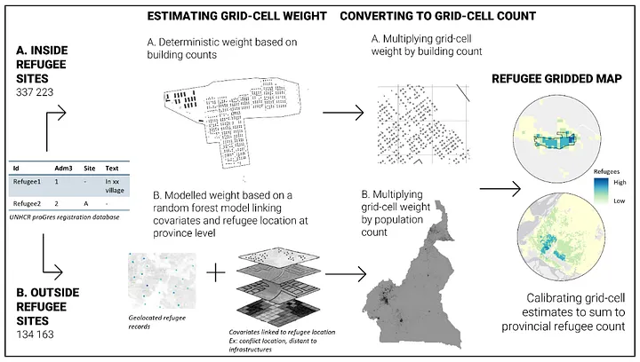

```{r setup, include=FALSE}
knitr::opts_chunk$set(echo = FALSE)
```

*The text comes from a Medium [article](https://medium.com/unhcr-innovation-service/smarter-refugee-surveys-for-a-more-effective-humanitarian-response-ceb9e83e1211) published by the UNHCR Innovation service.*

As global displacement continues to rise, accurate data collection on people forced to flee has become a critical aspect of humanitarian aid. Since 2003, UNHCR, the UN Refugee Agency, has maintained [proGres](https://www.unhcr.org/blogs/wp-content/uploads/sites/48/2018/03/2018-03-16-PRIMES-Flyer.pdf), its official population registration tool, to manage the personal data of forcibly displaced and stateless people. While this tool is essential for day-to-day humanitarian work, it is also becoming a key source of demographic information, which can act as a master sampling frame for conducting surveys that help assess the living conditions of these vulnerable populations. However, despite its importance, data from proGres has its limitations, particularly when it comes to extracting geographic information to map the locations of refugees, especially those living outside of formal settlements.

To tackle this challenge, UNHCR partnered with WorldPop, a research group at the University of Southampton, to explore the potential of combining registration data from [proGres](https://www.unhcr.org/blogs/wp-content/uploads/sites/48/2018/03/2018-03-16-PRIMES-Flyer.pdf) with satellite imagery to build more accurate sampling frames — lists of all individuals within specific areas, used to identify potential survey respondents. This project, supported by [UNHCR’s Data Innovation Fund](https://www.unhcr.org/innovation/data-innovation-fund/), seeks to address a critical issue: improving the process of mapping and surveying refugees, especially in out-of-camp contexts where populations are highly dispersed.

## The challenge: Sampling in complex humanitarian settings

Traditional survey methods involve a multi-stage sampling process, where enumeration areas (small geographical areas) are randomly selected for surveys, and then individuals are drawn from these areas. However, in the context of displaced populations, particularly those living outside formal settlements, this approach becomes impractical due to the rapid obsolescence of sampling frames that were designed before the displacement crisis and do not account for new movements. Even when sampling frames designed for standard household surveys are available, displaced populations often represent a small share of the overall population, which means that most sampled areas would contain zero displaced persons, making the process costly and inefficient. What is needed, then, are sampling frames designed specifically for studying displaced populations.



*Refugee population by province in Cameroon as of April 2023. Source: proGres Registration Database, 2023.*

This project originated from the challenges faced by UNHCR regional statisticians in West and Central Africa, Southern Africa, and the Americas when conducting surveys of refugees using traditional sampling methods, since gathering reliable information about the whereabouts of out-of-camp refugees requires substantial resources. In 2021, these statisticians (who are some of the authors of this piece) spotted a potential opportunity in an important paper authored by Sarchil Qader and other members of the WorldPop research group. This paper outlined a method to semi-automate the delineation of enumeration areas, which could then be used to conduct more accurate surveys. The success of these researchers in handling complex population mapping inspired the UNHCR statisticians to reach out to the lead author to explore a possible collaboration around the production of a survey sampling frame for refugees in Cameroon. The potential was clear: they could combine UNHCR refugee registration data with WorldPop mapping expertise to create something new.

## The solution: Leveraging satellite imagery and advanced modelling

In this project, UNHCR and WorldPop set out to explore whether novel data sources — such as satellite imagery and digital traces — combined with advanced statistical techniques and spatial data modelling could improve the creation of sampling frames.

One of the primary goals was to develop a gridded map of predicted refugee populations at a fine scale, as demonstrated in the Cameroon-focused pilot project. As of April 2023, UNHCR had registered 471,400 refugees in Cameroon. By combining proGres data with high-resolution satellite imagery, the collaboration aimed to more accurately map refugee populations, to provide better data for survey planning and humanitarian operations.



*Methodological framework for grid-based refugee mapping: A two-stage workflow. Source: proGres Registration Database, 2023.*

## Key outcomes

1.  Gridded maps for refugee population planning: The project’s flagship outcome was a 100m-resolution gridded map of predicted refugee populations in Cameroon, covering both camp and out-of-camp settings. This map can guide survey teams to focus on areas where refugees are likely to be concentrated, thus optimizing survey efforts and helping UNHCR and its partners direct resources more effectively. The map is not intended to provide precise population estimates at the grid-cell level, but rather to indicate the relative spatial distribution of refugees, highlighting areas with higher densities.

2.  Using proGres data to map refugee locations: This initiative delivered a better understanding of the spatial information contained in the proGres database. For example, 83% of registered refugees could be successfully located by cross-referencing proGres data with OpenStreetMap. This highlights the potential for further integration of digital spatial information like OpenStreetMap into UNHCR’s existing data pipelines, to improve the geographic detail of refugee data.

3.  Mapping refugee settlements using satellite imagery: Another deliverable of the project was a survey of the different products that could be used for mapping refugee camp layouts using satellite imagery. The highest accuracy was achieved using a building footprint dataset developed by Maxar Technologies and Ecopia AI. This data provides a clear view of refugee settlement patterns and can be complemented by manually mapping new settlements in dynamic settings, where population are moving fast and therefore camps layouts are rapidly changing.

In addition, this collaboration has underscored the value of the free-text fields in the proGres database which contain detailed location descriptions provided orally by refugees (given the lack of a unified address system). The project found that this data could be improved by standardising location details and increasing the usage of digital spatial tools such as OpenStreetMap.

## Limitations and cautions

While the project produced unprecedented insights into the locations of displaced persons across Cameroon, there are some limitations to the applied methodology:

Sparse mapping in low refugee areas: In administrative units with few reported refugees, the mapping can produce sparse, low-density estimates, which may dilute the actual presence of refugees in those areas.

Dependency on population map accuracy: The gridded refugee map relies heavily on the accuracy of the underlying population map. If inaccuracies exist in the population data, certain areas with refugee populations could be overlooked.

Furthermore, given the sensitivity of this data, the importance of using refugee maps responsibly must be emphasized. While the gridded maps provide valuable insights, there is potential for them to be misused for detrimental policies that target refugees. One solution is to aggregate the data at a broader scale or to restrict access to it, to ensure it is used only for humanitarian purposes.

## Looking ahead: Smarter surveys, better aid

The collaboration between UNHCR and WorldPop represents a significant step forward in the use of data for humanitarian efforts. By combining traditional refugee registration data with cutting-edge technology, including satellite imagery and advanced spatial modelling, this project has laid the groundwork for smarter, more targeted surveys.

With the estimates of refugees and asylum-seekers per grid cell allowing flexibility and comparability, this method is suitable for a wide range of use cases. The resulting data will provide invaluable insights in contexts where data disaggregation by sex and age is not currently available. This data could, for example, support targeted programme interventions, as well as acting as source data for other projects using statistical and machine learning techniques.

As a result, humanitarian agencies can better understand the needs of people forced to flee, even in dispersed and hard-to-reach locations. As this innovative approach continues to evolve, it promises to enhance humanitarian response efforts, ensuring that the most vulnerable populations receive the support they need, wherever they may be.

Read the full paper produced through this collaboration [here](https://jhumanitarianaction.springeropen.com/articles/10.1186/s41018-024-00157-6).
