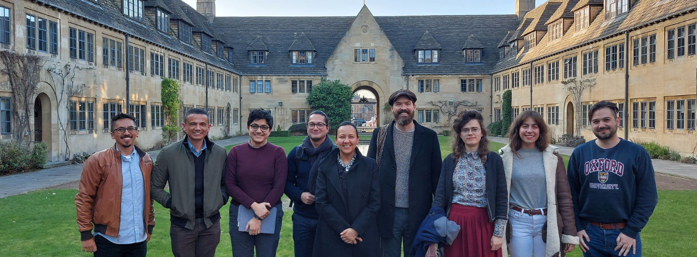

```{r setup, include=FALSE}
knitr::opts_chunk$set(echo = FALSE)
```

The Leverhulme Centre for Demographic Science is building a partnership
with the National Administrative Department of Statistics of Colombia
(DANE) to work together to address the challenge of outdated population
count in Colombia, paving the way for other national statistics offices
to follow.

Through our partnership with DANE, we are addressing the following
question: *Can we predict the demographics that a national census would
observe if it were conducted today?*

This project is designed to build the foundation to answer this question
by achieving four objectives:

1.  Build knowledge at DANE to implement Bayesian statistical modelling,

2.  Install necessary computing infrastructure at DANE,

3.  Implement a pilot project as a proof-of-concept to “predict the
    census”, and

4.  Foster new relationships for broader collaborations between Oxford
    and DANE.

Our ultimate aim is to produce annual population estimates for official
use by the Colombian government and to share these approaches with a
network of national statistics offices globally through our partnership
with the United Nations Population Fund (UNFPA).

We conducted conduct a one week capacity-building workshop at DANE in
Bogotá, Colombia in partnership with UNFPA. We taught fundamentals of
Bayesian statistics to representatives from 5 national statistics
offices in Latin America, targeting methods to produce annual small area
population estimates using the 2018 Colombian census, annual
administrative registers, geospatial data, and social media data. We
then invited DANE researchers to visit Oxford for a one week knowledge
exchange workshop intended to spark additional collaborations and expand
the partnership between our institutions to include a broader range of
topics and diversity of researchers.



Building on this visit, we worked on two different research projects.

The first one consist on using confidential Colombian census data as a
benchmark for testing satellite-imagery derived population. The results
have been
[published](https://onlinelibrary.wiley.com/doi/10.1002/psp.70083) and
have shown that detailed building footprint data significantly improves
accuracy of population model, and that Bayesian models are more
effective than machine learning when the input data is biased.

The second research strand consists in modelling intercensal population
by leveraging the signals from administrative records to update the 2018
census. I have accessed to anonymized administrative data for 50 million
Colombians in 52 administrative databases. I am currently working on a
state-space model, where the process model is based on the cohort
component framework for population projecton that are nowcasted through
observation models based on the administrative records.
