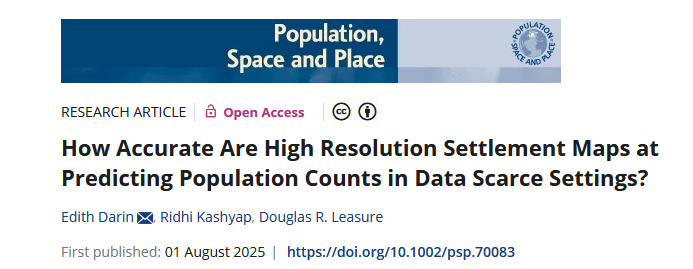

```{r setup, include=FALSE}
knitr::opts_chunk$set(echo = FALSE)
```

In a world where more than a quarter of countries haven’t conducted a census in over 10 years, the need for alternative ways to estimate population is urgent. From conflict zones to remote rainforests, reliable data is often out of reach—but decisions on healthcare, education, disaster relief, and infrastructure still need to be made.

Our new study, published in Population, Space and Place, explores one of the most promising alternatives: using satellite imagery to estimate population counts in data-scarce regions.



## Why This Matters

Traditional censuses are expensive, logistically complex, and sometimes simply not possible—especially in areas affected by violence, displacement, or lack of infrastructure. In such contexts, satellite imagery has become an increasingly attractive solution. But how accurate is it?

To find out, we used the 2018 Colombian census—one of the most complete and detailed in the world—as a testing ground. We compared different satellite-derived settlement maps and modeling approaches to see how well they predicted actual population counts.

## What We Tested

We compared:

-   Six settlement maps, including building footprints from Google and Microsoft, and pixel-based “built-up area” maps.

-   Two modeling approaches:

    -   A Bayesian probabilistic model, which can incorporate uncertainty and adjust for bias.

    -   A random forest machine learning model, commonly used for pattern recognition in data-rich settings.

## Key Findings

**Building footprints are best**: Maps that show individual buildings (like those from Google and Microsoft) were the most accurate for estimating population, especially in urban areas.

**Bayesian models win in tough settings**: When data was sparse, biased, or incomplete—as it often is in remote or forested regions—Bayesian models outperformed machine learning.

**Aggregated results are more reliable**: Predictions were more accurate at larger spatial scales (e.g., municipalities) than at fine-grained levels like individual neighborhoods.

**Remote regions are still hard**: Accuracy dropped significantly in regions like the Amazon and Pacific coast, where buildings are harder to detect from above.

Take home message: In data-scarce settings, we can't rely on standard algorithms alone—probabilistic models are essential to correct for bias and uncertainty.

## What This Means Going Forward

As more organizations rely on satellite data for planning and policy, our research highlights some critical lessons:

-   Open, high-resolution building data is essential.

-   Statistical models need to be adapted for local realities, especially in contexts where conventional data is lacking or biased.

-   Ground-truthing with even small samples can dramatically improve model performance.

Want to dive deeper? Read the full [paper](https://doi.org/10.1002/psp.70083)
