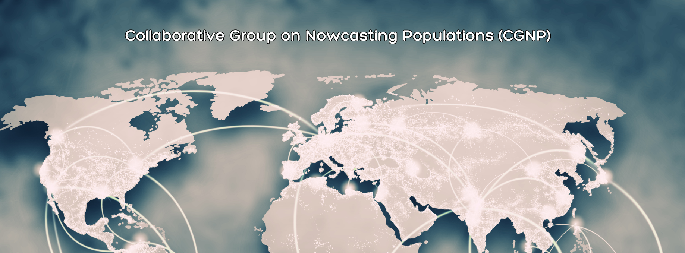

```{r setup, include=FALSE}
knitr::opts_chunk$set(echo = FALSE)
```

*Original source:* <https://www.demography.ox.ac.uk/collaborative-group-nowcasting-populations-cgnp>

Thanks to funding from Oxford University’s Van Houten Fund, Dr Andrea Aparicio Castro and the Nowcasting Populations (NowPop) team at the Leverhulme Centre for Demographic Science (LCDS) have established the Collaborative Group on Nowcasting Populations (CGNP) to foster collaboration among leading academic institutions and research centres in demographic science.

The CGNP initiative aims to advance knowledge of nowcasting populations, mobility, and migration by combining Bayesian and other methodologies with digital trace and traditional data sources. The groups work addresses critical challenges in contexts where conventional data collection is limited, such as conflict zones, and provides timely insights to support humanitarian responses.

A key project goal of the initiative is to build and strengthen a community focused on real-time estimation or nowcasting population and mobility, using traditional and digital trace data. Another goal is to establish a foundation for collaborative work and potential application for large grants by exploring and defining common themes.

The CGNP initiative is led by LCDS’s NowPop project team that drives innovation for near real-time population estimation and involves researchers from Oxford University’s Department of Sociology. This initiative is also a collaboration with teams led by Professor Arkadiusz Wiśniowski at the University of Manchester’s Department of Social Statistics, Professor Jakub Bijak and Dr Jason Hilton at the University of Southampton, and Professor Francisco Rowe, Dr Elisabetta Pietrostefani and Dr Carmen Cabrera-Arnau at the University of Liverpool’s Geographic Data Science Lab.

Key activities of the group include collaborative development sessions conducted at the start and conclusion of the project to align on themes and refine research proposals, expert workshops to identify shared research interests and explore opportunities for sustainable grant applications, and training sessions to enhance skills in Bayesian statistical demography and digital data analysis across partner institutions.


