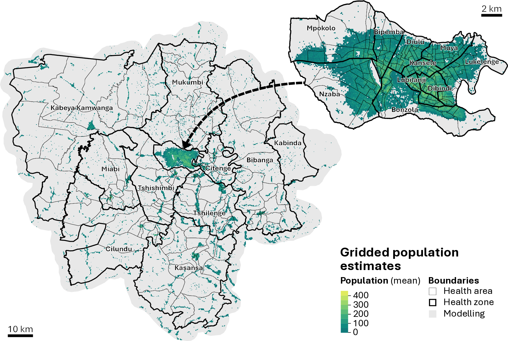
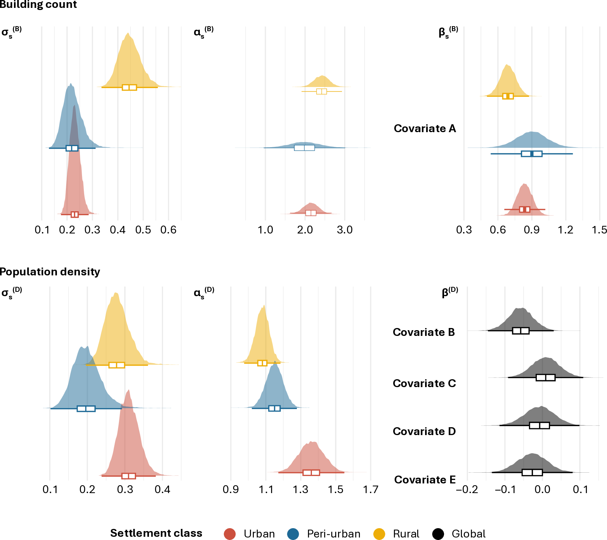

```{r setup, include=FALSE}
knitr::opts_chunk$set(echo = FALSE)
```

Reliable population data is essential for public health planning, yet in many regions, especially in low- and middle-income countries, census data is outdated or missing. This creates challenges for everything from vaccine delivery to health resource allocation.

We recently published in PLOS Global Public Health a method to estimate populations in these data-scarce settings using a Bayesian statistical model. We applied the approach in Kasaï‑Oriental province in the Democratic Republic of the Congo, combining household survey data with satellite-derived settlement data to produce fine-scale population estimates.



# Highlights

-   The model estimates 4.1 million people living in the province in 2024, with an uncertainty range of 3.4 to 4.8 million.

-   Estimates are produced at a 1-hectare resolution, then aggregated to health zones and areas.

-   The method accounts for data uncertainty and provides credible intervals, offering more transparency than traditional mapping methods.

-   Accuracy metrics indicate the model performs well even in areas with limited ground data.

This approach is particularly useful in contexts where ground data collection is difficult or inconsistent. The results can support more targeted public health strategies and better planning at subnational levels.

# Novelty

We implemented a model component for debiasing building footprint data derived from satellite imagery by integrating true building count observed on the ground.



Read the full [paper](https://journals.plos.org/globalpublichealth/article?id=10.1371%2Fjournal.pgph.0005072&utm_source=chatgpt.com)
