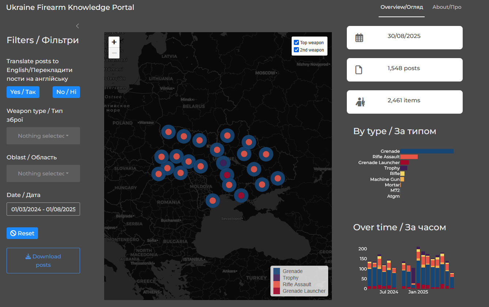

# Ukraine Firearm Knowledge Portal

The [Ukraine Firearm Knowledge
Portal](https://ukraine-firearms-dashboard-viz.share.connect.posit.cloud/)
is a web‑based dashboard that lets anyone explore information about
firearms that appear in Ukrainian social‑media posts. It’s built with
the R /Shiny framework and runs in the cloud, so you can reach it from
any browser without installing software.

## What you see when you open the dashboard.

-   Map of Ukraine – Each region (oblast) shows the two most‑mentioned
    firearm items with coloured circles. Bigger circles mean the item is
    mentioned more often.

-   Key numbers (metrics) – Quick stats such as the most recent posting
    date, total number of posts, and total mentions.

-   Charts – Over‑time bar chart shows how many posts mention each item
    month by month. Category chart displays the total counts for each
    firearm type.

-   Data table – A searchable, scrollable list of every post, with
    coloured “badge” labels, a thumbnail of the associated screenshot,
    and a link to the original source (Facebook, Telegram, etc.).

-   Language switch – Buttons let you toggle all labels, legends and
    text between English and Ukrainian.

All of these elements react instantly when you change the filters
(items, regions, date range). There’s no “Apply” button; the dashboard
updates automatically, with a short pause to avoid overwhelming the
server.

## How the data get there

-   Source material – Social‑media posts are collected in Google Drive
    as CSV files.

-   Database – Those CSVs are loaded into a lightweight DuckDB database
    that lives on the server. DuckDB does the heavy lifting (splitting
    multi‑value fields, grouping by month, etc.) so the R code only
    pulls the exact slice you need.

-   Screenshots – Static images of the original posts are stored on
    Cloudflare and referenced by predictable URLs
    (year‑month/post‑id.png).

When the dashboard starts, it authenticates to Google Drive, opens the
DuckDB file, builds a few helper views, and caches colour palettes and
filter choices for speed.

## Who can log in and what they can do

-   Regular users – Log in with an email address. Their email is checked
    against a users.csv file stored on Google Drive. Once logged in they
    can explore the dashboard.

-   Admins – If the email matches the designated admin account
    ([ukraine.firearms.dashboard\@gmail.com](mailto:ukraine.firearms.dashboard@gmail.com){.email}),
    an extra Update tab appears. From there admins can trigger automated
    pipelines that: Pull fresh text files from Google Drive, rebuild any
    derived resources, and commit them to the GitHub repository. Pull
    new Excel spreadsheets and screenshots, process them, and publish
    the updated images to Cloudflare.

These pipelines run as GitHub Actions and take a few minutes; after they
finish the dashboard picks up the new data on the next page reload.

## Where everything lives

| Component | Where it’s hosted |
|----|----|
| Shiny app | Posit Connect Cloud (deployed from GitHub) |
| Dashboard code (open source) | [Github](https://github.com/ukraine-firearms-dashboard) |
| Source CSV / Excel files, users.csv | Google Drive (accessed via a service‑account token) |
| Static screenshots | Cloudflare Workers CDN (URL pattern {YYYY‑MM}/{post_id}.png) |
| Automation scripts & CI/CD | GitHub repositories + GitHub Actions |
| Secrets (tokens, passwords) | Environment variables on the server and GitHub repo secrets |

## Bottom line

The portal gives a fast, interactive view of how firearms are discussed
on Ukrainian social media, with a map, charts, and a searchable table.
It’s built to be maintainable: data processing happens inside DuckDB,
the UI updates reactively, and administrators can refresh the whole
dataset with a single button that launches pre‑configured GitHub
workflows. All of this is secured by email‑based login backed by a
Google Drive user list, and the system is ready to be extended with more
languages, authentication methods, or automated update schedules.
