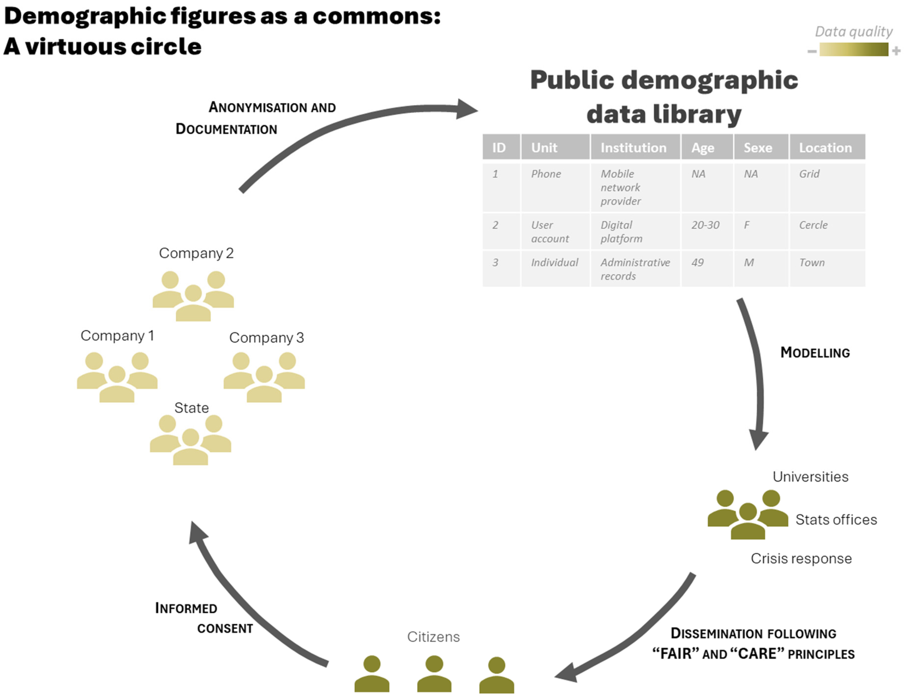

```{r setup, include=FALSE}
knitr::opts_chunk$set(echo = FALSE)
```

And here I am, almost by accident, becoming an expert in census-taking in conflict zones. It started in 2020, as Burkina Faso struggled to complete its national census due to escalating insecurity in the north-eastern region, when I was approached to “fill in the gaps”—not on the ground, but from my office, thousands of kilometres away. Drawing on my expertise in population modelling with satellite imagery at a British research institute, I was able, with the support of advanced statistics, pixels, and funding from the Bill and Melinda Gates Foundation, to estimate the populations of areas that had become inaccessible to surveyors of Burkina Faso's National Statistics Office. The estimates were based on non-open data provided by a Canadian private company, Ecopia.AI. Mission accomplished: I had left “no one behind,” as proclaimed by the Sustainable Development Goals. Yet a lingering doubt remained. Had I not undermined two foundational relationships inherent in census-taking: that between the enumerator and the enumerated, and that between the state and its citizens?

This question marks the starting point of the article published in [Big Data and Society](https://doi.org/10.1177/20539517251403948), which explores how the rise of digital data has reshaped the ways in which populations are enumerated. It finishes on the proposition for building a Public Demographic Data Library as exemplifies by the schema below.


