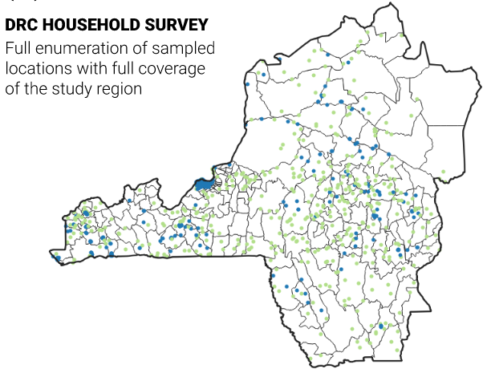
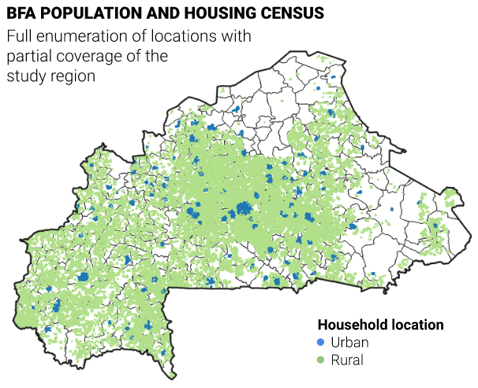
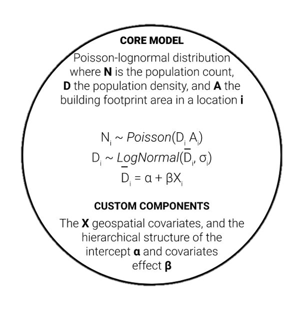
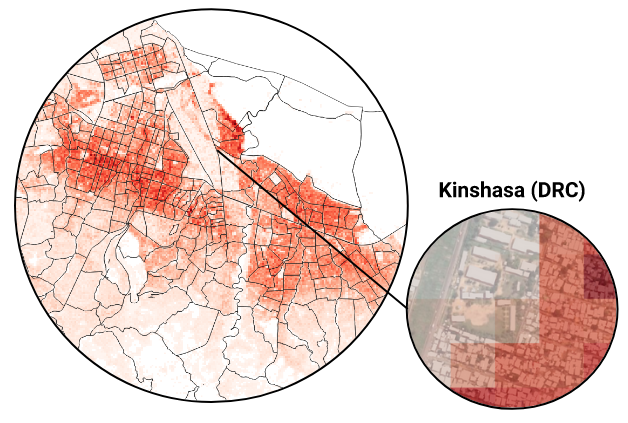

```{r setup, include=FALSE}
options(htmltools.dir.version = FALSE)
xaringanExtra::use_scribble(
  pen_color = "#408000"
)
library(tidyverse)
library(kableExtra)
```

# Introduction
<br>
<br>


---
class: inverse, middle

# Two issues

---
# Outdated census

<br>

.pull-left[

]

.pull-right[

**The DRC**

- West to East = Paris to Kiev
{{content}}

]


--

- North to South = Copenhagen to Sicily
{{content}}

--

- Last census 1984 (when it was still Zaire)


---
# Outdated census


## Available population microdata

--

### A microcensus

.pull-left[
- xx well-defined clusters
- Representative coverage
- Full enumeration
]

.pull-right[

]
---

# Incomplete census


<br>

.pull-left[

]


.pull-right[

- Census in 2019
{{content}}

]

--

- Security issue in the North and East
{{content}}

--

- 20% country missing
---
# Incomplete census

## Available population microdata

--

### Enumeration areas

.pull-left[
- 15 000 clusters
- Full coverage of surveyed regions
- Full enumeration
]

.pull-right[

]
---
class: inverse, middle

# A common challenge

### Estimating population from sparse microdata

---
class: clear, middle
background-image: url(ipc2021_presentation_files/pic/background_griddedpop.png) 

## .bg-white[A technical solution: ] 
## .bg-white[  Gridded population!]

---
# Brief history of gridded population
## A concept from digital photography and GIS

Spatial representation of a continuous variable

--
## Between confidentiality and precision

- 1960's in Danemark, Sweden for communicating household locations from their postal address

--
- Global initiative: NASA Goddard Institute for Space Studies, 1984


```{r  out.width = "50%", echo=FALSE, fig.align="center"}
 
```
---
class: clear, middle

## It offers a common support for the missing areas

<br>

```{r  out.width = "50%", echo=FALSE, fig.align="center"}
 
```

---
class: clear, middle
background-image: url(ipc2021_presentation_files/pic/background_griddedpop.png) 

## .bg-white[A modelling solution: ] 
## .bg-white[  Bayesian hierarchical structure]
---

# A model from ecology

When counting people can learn from counting animals

<br>

--
```{r  out.width = "50%", echo=FALSE, fig.align="center"}
 
```

---
# Flexible components


```{r, echo=F}
component <- dplyr::tibble(
  #" " = c(rep('Hierarchy',3), rep('Covariates', 4), rep('Submodels',3)),
  "DRC" = c("Settlement type", "Province", "Sub-province",
            "Average building proximity",
            "Average building focal count (2km)",
            "Average building area", "",
            "Random effect of covariates",
            "Weighted likelihood",
            "Dirichlet-multinomial for age-sex count"),
  "BFA" = c("Settlement type", "Region", "Commune",
            "Distance to temporary rivers","Average building focal count (2km)", "Friction surface", "2019 UN projections disagregated","", "", ""

            )
)


component %>% 
  kbl() %>% 
  pack_rows(index = c("Hierarchcy" = 3, "Covariates" = 4, "Submodels" = 3)) %>% 
  kable_styling(font_size = 13)
```

---
# Validation

## Crossvalidation for a study sites sample

--
<br>
```{r, echo=F}
pred <- tibble( 
  " " =c( "Bias",	"Imprecision",	"Inaccuracy", "R^2",	"95% CI"),
  "DRC"= c( "13",	"173", "106",	"0.79",	"91%"),
  "BFA" = c( "45",	"262", "169",	"0.63",	"95%")) %>% t()

pred %>% 
  kbl() %>% 
  kable_styling(font_size = 15)
```

--

## Visualisation

```{r, echo=FALSE, fig.show="hold", out.width = "40%" }
 
 
```

---
# Accessing Bayesian estimates
Output: gridded Bayesian predictions, that is >9000 population estimates per grid cell

--

## A bespoke Shiny application

```{r, echo=FALSE, out.width = "100%"}
 
```
---
# Summary

```{r, echo=FALSE, out.width = "100%"}
 
```